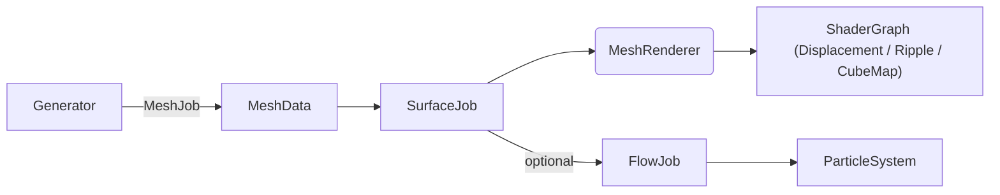

# 🏝️ Islands – Burst‑Driven Procedural Terrain Toolkit

> **Docs build** 2025-06-09

Islands is a collection of *data‑oriented* Unity packages that let you generate
meshes, sculpt them with SIMD/Burst noise, and shade them with Shader Graphs ‑ **in real time**.

It also ships with a small **GraphLibrary** (directed/undirected weighted graphs) useful for higher‑level generation tasks (roads, region adjacency, quest graphs, etc.).

<p align="center">
  
</p>

---

## ✨ Modules at a glance

| Layer | Package | What it does | Key file |
|-------|---------|--------------|----------|
| **Noise** | `UnityBurstNoise` | SIMD, Burst‑compiled Perlin / Simplex / Voronoi + derivatives | [`noise.md`](Documentation~/noise.md) |
| **Mesh** | `ProceduralMesh` | Parametric generators + job wrapper & vertex‑stream variants | [`mesh.md`](Documentation~/mesh.md) |
| **Surface** | `ProceduralSurface` | CPU displacement (SurfaceJob) & particle FlowJob | [`surfaces.md`](Documentation~/surfaces.md) |
| **Shaders** | `IslandsShaders` | Displacement, ripple, cubemap, HLSL helpers | [`shaders.md`](Documentation~/shaders.md) |
| **Graphs** | `GraphLibrary` | Directed/undirected weighted graphs (data structures) | [`graphs.md`](Documentation~/graphs.md) |

---

## 🔗 Pipeline overview



1. **MeshJob** builds the analytic shape.  
2. **SurfaceJob** adds fractal detail & rebuilds normals/tangents.  
3. **Shader Graph** applies final effects (height, normal map, ripples).  
4. **FlowJob** (optional) moves particles across the surface.

---

## 🚀 Quick start (Unity 2022.3 LTS + Burst 1.8)

```bash
# 1. clone
git clone https://github.com/yourname/Islands.git

# 2. open project in Unity Hub
# 3. open scene:  Assets/Samples/IslandScene.unity
# 4. press ▶️  – tweak params in Inspector
```

*Minimum hardware*: SSE4.1 (x86) or NEON (Apple Silicon / ARM).

---

## 📚 Documentation map

| What you want to do | Where to read |
|---------------------|---------------|
| Understand SIMD noise | **noise.md → SIMD Packing** |
| Add a new mesh generator | **mesh.md → Practical Tips** |
| Displace vertices on CPU | **surfaces.md → `SurfaceJob`** |
| Hook up Shader Graph parameters | **shaders.md → Property tables** |
| Integrate your own noise in GPU | **shaders.md → Shared HLSL helpers** |
| Build / traverse graphs | **graphs.md → GraphLibrary overview** |

---

## 🧩 Package layout

```
Packages/
└── com.islands.core/
    ├─ Noise/                # Burst noise library
    ├─ Mesh/                 # Generators & streams
    ├─ Surface/              # SurfaceJob, FlowJob, MonoBehaviours
    ├─ Graphs/              # GraphLibrary (directed/undirected weighted graphs)
    └─ Shaders/              # Shader Graphs + .hlsl helpers
```

Each folder contains its own `Runtime/`, `Editor/`, `Tests/`, and `Documentation~`.

---

## ❓ FAQ

* **What’s the GraphLibrary for?** — A lightweight, generic graph data structure used by future systems (roads, biome adjacency, POI networks). See **graphs.md**.
* **Why four‑wide (`float4`) everywhere?**  — Keeps Burst in SIMD mode 100 % of the time.  
* **Can I use GPU‑only displacement?**  — Yes; skip `SurfaceJob`, enable vertex displacement node in the Shader Graph.  
* **Does it work in HDRP?**  — Yes. `MultiStream` matches HDRP’s default 4‑stream layout.  

More questions? Check the [issues](../../issues) or open a new one.

---

## 📝 Unified changelog

See [`CHANGELOG.md`](CHANGELOG.md) for updates across all modules.

---

## ⚖️ License

MIT © 2025 – inspired by Catlike Coding.  Pull requests welcome!
